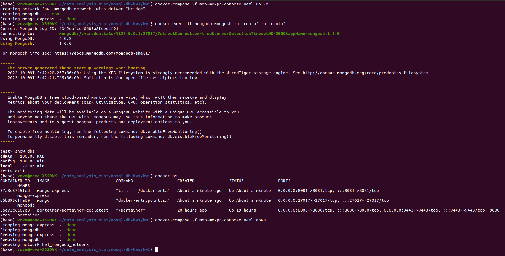
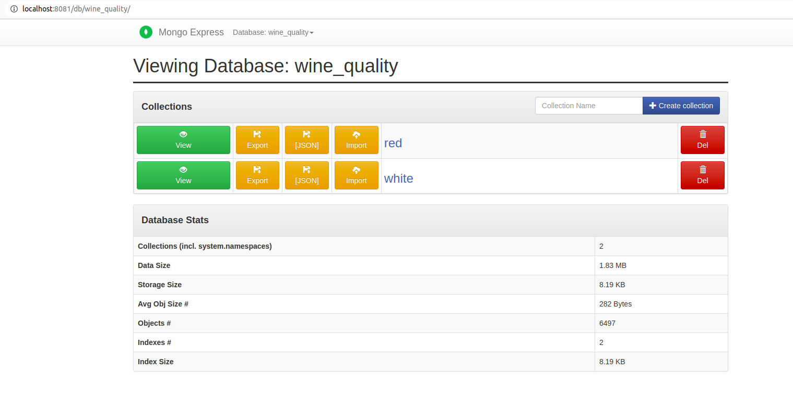
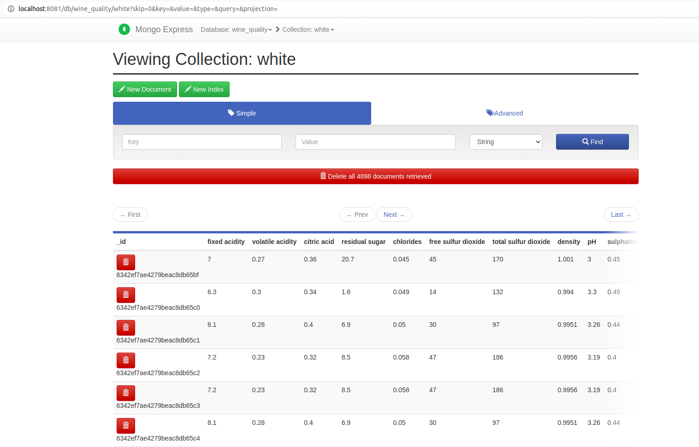
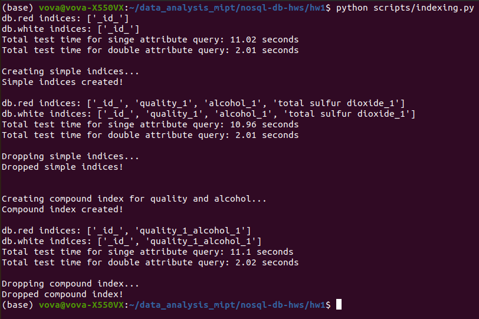
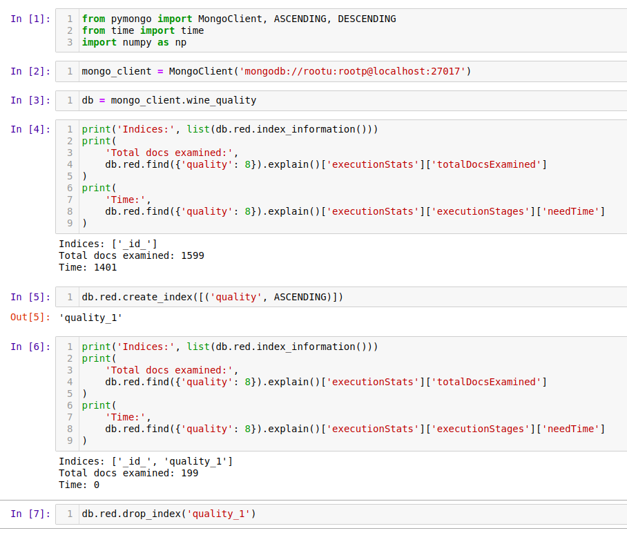

### HW 1. MongoDB.

#### MongoDB installation.
To run MongoDB and Express in Docker use [mdb-mexpr-compose.yaml](mdb-mexpr-compose.yaml) file and command
```
docker-compose -f mdb-mexpr-compose.yaml up -d
```
The compose file is taken from lecture. To connect to Mongo through MongoShell use command
```
docker exec -it mongodb mongosh -u "rootu" -p "rootp"
```
To stop and remove containers use
```
docker-compose -f mdb-mexpr-compose.yaml down
```
Images and volumes will remain.



#### Data filling.
[Wine Quality Data Set](https://archive.ics.uci.edu/ml/datasets/wine+quality)
is used to create database. The data is initially in .csv format. To transform it
to .json format and load into MongoDB a Python script
[load_wine_csv.py](scripts/load_wine_csv.py) is used.

To run the script use command
```
python scripts/load_wine_csv.py
```
To learn more about the data check [this](data/winequality.names).

It is possible to view dataset via Express.





#### Read and update data.
[PyMongo](https://pymongo.readthedocs.io/en/stable/) is used for reading and updating.
Check [read_update.py](scripts/read_update.py) for details.
Results are written to [read_update_logs.txt](read_update_logs.txt) file.

There are 2 main functions: *some_read_queries()* and *some_update_queries()*.
Read queries include simple general aggregations via StatsCalculator class and
some *.find()* and *.aggregate()* calls description of which one may find in code and
log file both. Update queries include one example of *$inc* usage and one example of *$set*.
Then some statistics over collections are calculated again in order to verify changes. All
operations are logged into the log file.

To run the script use command
```
python scripts/read_update.py
```

#### Indexing. Performance tests.
Check [indexing.py](scripts/indexing.py) for details.
To run the script use command
```
python scripts/indexing.py
```
The script runs as follows:

- At the beginning of execution it performs simple *.find()*
  queries over 3 different fileds: *'quality', 'alcohol'* and *'total sulfur dioxide'*
  trying to find documents which includes a value within a given range. It repeats so 100 times.
  Then it runs another *.find()* query to find documents with 2 specified values. It also repeats so
  100 times. Check functions *test_one_index()*, *test_two_indices()* and *perform_tests()* for details.

- Then the script creates simple *ASCENDING* indices for each of 3 fields and repeats testing procedure that is
  described above. After this testing the script deletes these indices. For details check *create_simple_indices()*
  and *drop_simple_indices()*.

- At the end a compound index *'quality_1_alcohol_1'* is created. Then tests run again and this compound index is dropped.

While working the script measures execution time and prints results. See example below.



Actually, results show that adding indices don't really improve performance in this certain case. Probably it's because
this dataset is quite small. Only 6497 objects in total.

To see an evidence that indices actually work check the screenshot below.



So the number of documents that query examine is limited to the exact number of documents with the specified value
(1599 is the total number of documents in collection db.red).

