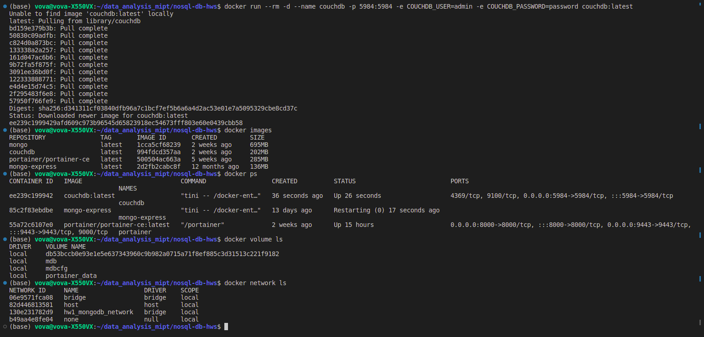
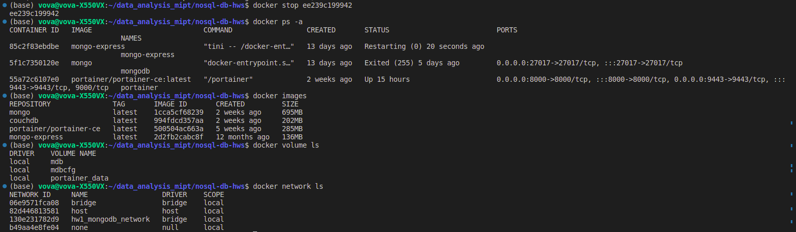
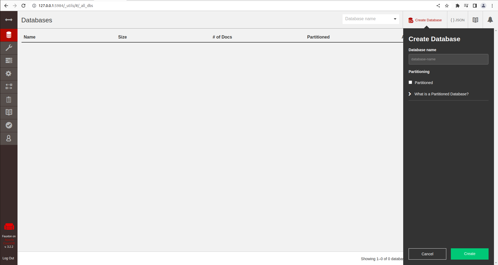
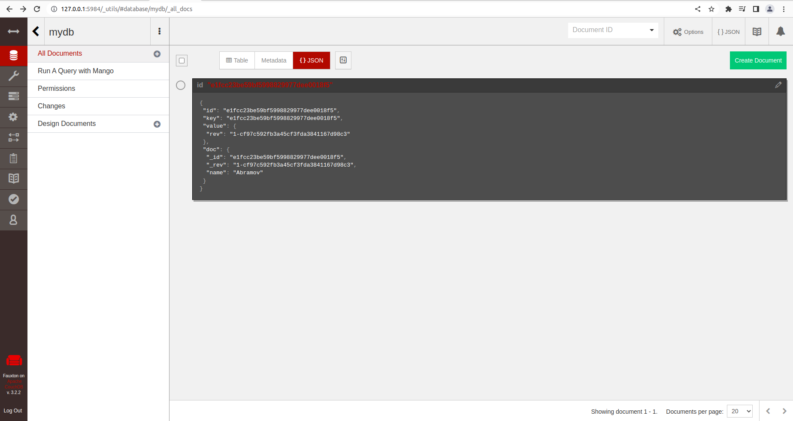
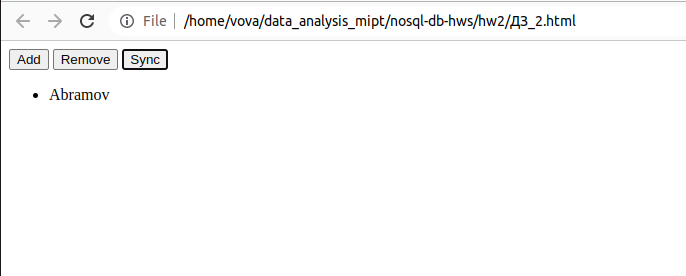

### HW 2. CouchDB and PouchDB.

#### CouchDB installation.
To run Docker container with CouchDB use
```
docker run --rm -d --name couchdb -p 5984:5984 -e COUCHDB_USER=admin -e COUCHDB_PASSWORD=password couchdb:latest
```


To stop the container run 
```
docker stop CONTAINER_ID
```


Container will be deleted but the image will remain.

#### CouchDB management.
To use Fauxton connect to
```
http://127.0.0.1:5984/_utils
```
Fauxton is a native web-based interface built into CouchDB.

#### Create Database in CouchDB.
Fauxton can be used for this task. Specify the name of your new DB and whether you want to
replicate it or not.


##### Add document to CouchDB Database.
Use Fauxton.


#### Run PouchDB and connect it to CouchDB.
Specify your CouchDB Database location in [.html](%D0%94%D0%97_2.html) file (lines 25-30). Run this file
in browser. Mind managing CORS in config via Fauxton.



### Note.
[couchdb-python](https://github.com/djc/couchdb-python) can be used for some tasks, though it is not maintaied for a few years.
