### HW 3. Redis.

#### Deployment.
To run Redis and RedisInsight in Docker use [compose file](redis-redisinsight-compose.yaml)
and command:
```
docker-compose -f redis-redisinsight-compose.yaml up -d
```
The compose file is taken from lecture.

To remove containers and network run:
```
docker-compose -f redis-redisinsight-compose.yaml down
```
Images and volumes will remain.
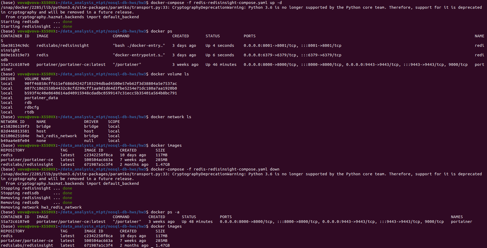

In order to connect to your Redis database from RedisInsight you need to know IP of your database.
To get it run
```
docker network inspect NETWORK_NAME
```
where NETWORK_NAME is the name specified in compose file. Navigate to containers and get the address there
(without the mask ofc).

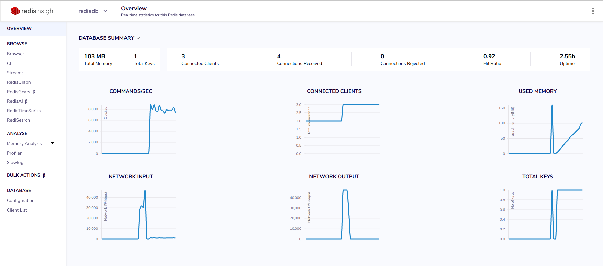


#### Data filling.
[Data](data/uber-raw-data-jul14.csv) is taken from
[here](https://www.kaggle.com/datasets/fivethirtyeight/uber-pickups-in-new-york-city?select=uber-raw-data-jul14.csv).
It is initially in the .csv format, so in order to transform it to .json use [this](scripts/load_json.py) script.
Note that .csv file is 37 MB and raw .json file is almost 80 MB and has 800'000 key-value pairs.

There are multiple ways to fill Redis with this data. Below you can see some of them, that will be used to conduct
write/read performance tests.

**String.** Just one key and a string, which reperesents full JSON file
(to see an approach with many keys check Redis Cluster section).

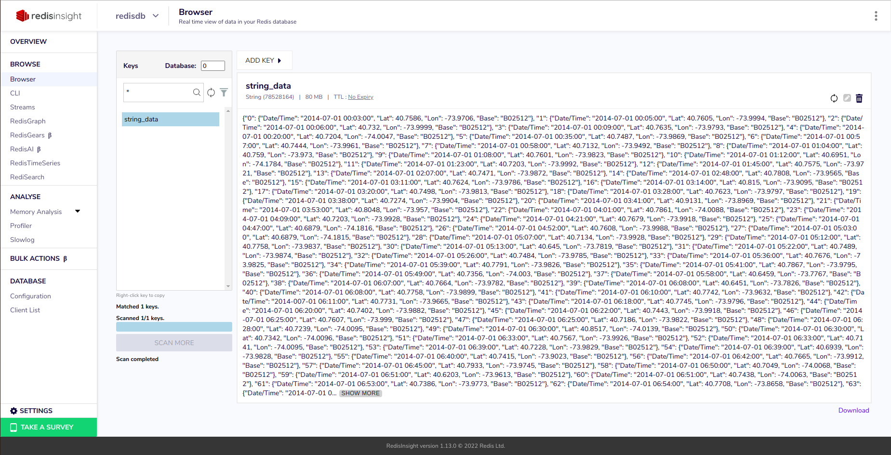

**Ordered Set.** A single ordered set as one key. It can be filled as a chunk, all rows at once,
and also row-by-row. The 2nd way is much slower. Check functions `load_zset_chunk` and `load_zset_rows`
from [this](scripts/zset_test.py) file to see the details.
The performance will be discussed in another section below.

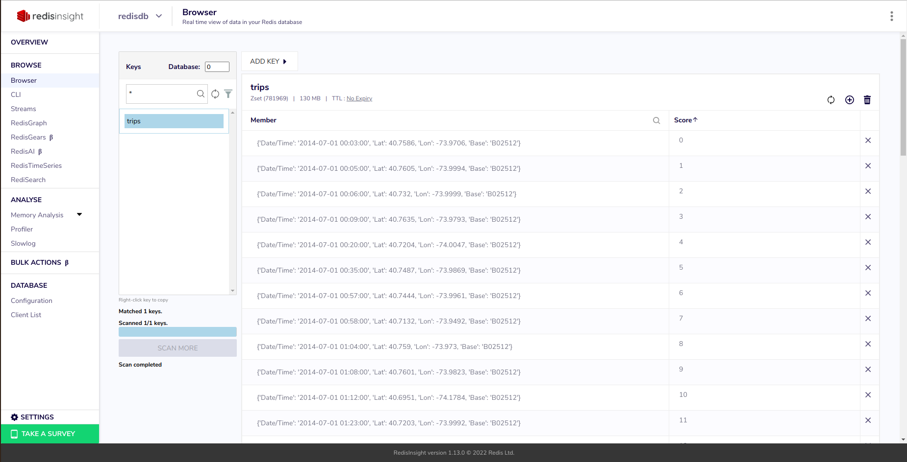

**HashSet.** There are 2 approaches. One is to add everything to a single HSet

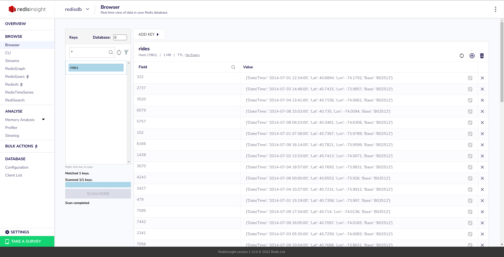

and another is to create multiple keys from time stamps and assign an HSet to each of them.

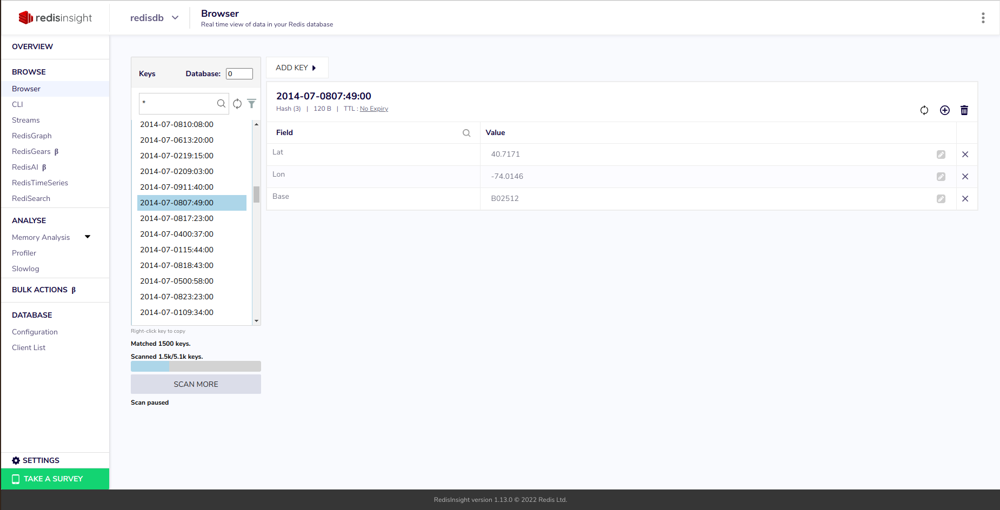

**Linked List.** Simple list where each element is an item from JSON.

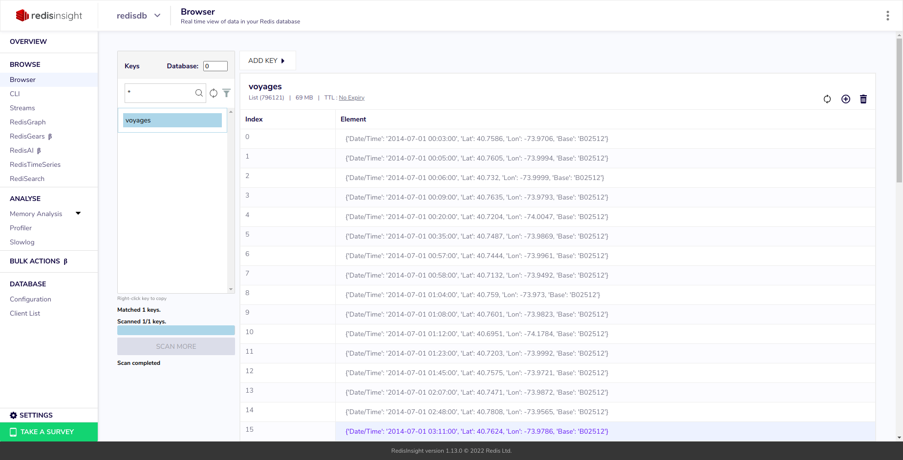


#### Write/Read performance tests.
To run tests run [this](scripts/run_tests.py) script:
```
python scripts/run_tests.py &> tests-result.log
```
To see results check [this](tests-result.log) file. To see the code for tests
check the [scripts](./scripts/) folder.

The script tests all 4 approaches to save JSON data that are mentioned above.
It also tests reading and deleting performance. Some info functions like *ZCARD*
are also tested.

**String.** Saving 80 MB string takes ~3 seconds (+ 3 seconds to convert JSON to str type in Python).
Getting this string is ~0.3 seconds which is 10 times faster than saving. Deleting takes ~5 ms.

**ZSet.** If we save in chunk mode (single zadd on a python disctionary with ~800k k-v pairs)
then it takes ~4 seconds. Saving each k-v pair individually takes ~100 seconds and is ineffective.
Also note that ZSet takes 130 MB of space, which is more than a string.

Removing the whole Ordered Set by key using `DEL` takes ~0.15 seconds.
Removing a single element or multiple elements, up to hundreds of thousands,
takes ~0.1 ms.

Time for retrieving elements strongly depends on a number of them. If it is ~1-1000 then
getting them takes ~0.1-0.7 ms. The whole ZSet can be retrieved in ~2 seconds.

ZCard and ZCount work in ~0.3-0.5 ms. And the range for ZCount doesn't matter.

**HSet.** This data structure occurs to be not very efficient in terms of time
in my case. The reason for that is simple. There are too many transformations
applied to data via Python before it can be set to the HSet. So most tests here are only for
1% of the data.

The whole JSON can be saved in ~2 minutes and it takes 56 MB of space in case of a single HSet.
If 1-element-1-HSet approach is applied then time grows to ~6-7 minutes and data volume stays
the same.

Getting elements one-by-one depends on time and takes from ~0.1 ms to ~0.1 seconds for 1-10 elements
and 100-1000 elements respectively. Getting elements all at once (`HGETALL`) takes ~0.04 seconds for
~8k of elements.

Removing elements in case of one-by-one approach takes roughly the same time as getting them.
Removing the whole HSet all at once takes ~0.1 second for ~8k of elements.

**List.** Pushing ~800k of elements takes ~2 seconds. Popping them all takes roughly the same time.
Indexing elements works in ~0.1 ms for any element. The list takes ~70 MB of space.

`LREM` and `LTRIM` works pretty fast in all cases and their speed is analogous to
the speed of indexing.


#### Redis Cluster.

##### Cluster Deployment and Management.
To setup Redis Cluster with 3 master nodes and RDB + AOF persistence options enabled
run [setup](cluster-setup.sh) bash script using command:
```
cat cluster-setup.sh | docker exec -i redisdb bash &> cluster-setup.log
```
It will create folders with different *redis.conf* files in the docker container
file system. Check lines 22-26 to see how RDB and AOF is configured.

Then the script runs `redis-server` command to run nodes (lines 38-49). And finally, it
runs `redis-cli --cluster create` command to start the cluster (lines 51-55).

**Note:** before running the setup script update the IP value (line 52) so that you can
connect to the cluster using RedisInight. You can get this IP using `docker network inspect`
as described above. You may also need to update rights for setup file using `chmod 777 cluster-setup.sh`.

Check the [log](cluster-setup.log) file to see setup details.

To connect to the cluster one may use RedisInsight via the IP and ports 7000, 7001, 7002
or command:
```
docker exec -it redisdb bash
```
to interact with cluster directly.

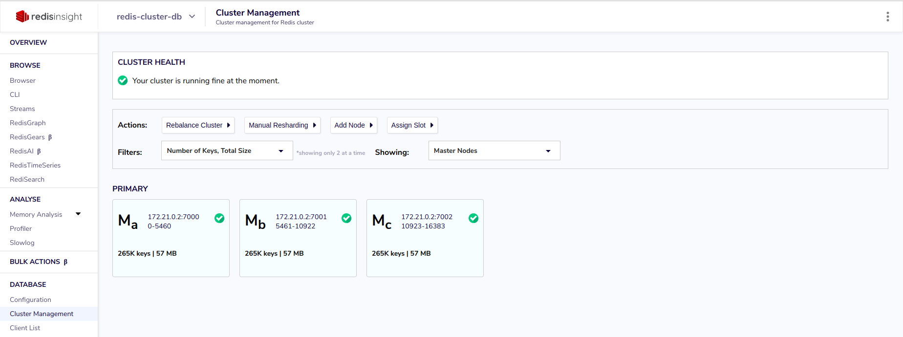
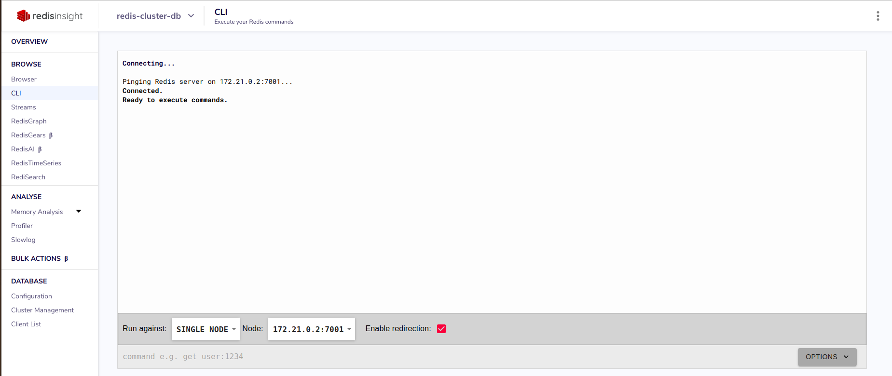
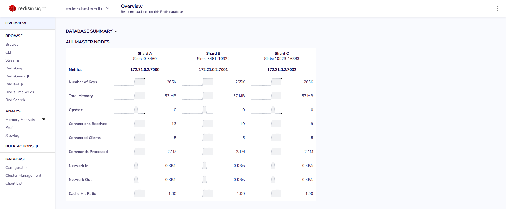

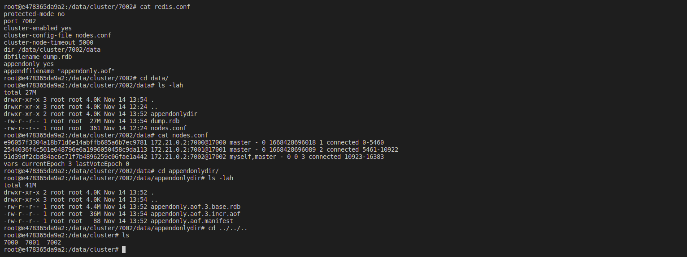

To connect to one of the nodes while you are inside a docker container use `redis-cli -p PORT -c`
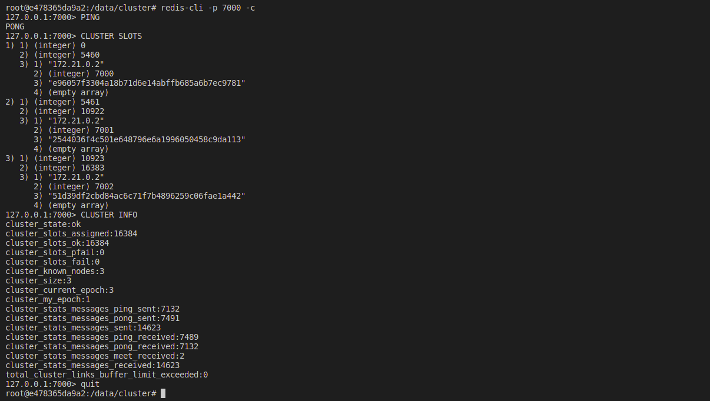

##### Cluster data filling.
To fill the cluster with data [this](scripts/test_cluster.py) script was used.
To run it use:
```
python scripts/test_cluster.py &> cluster-tests-result.log
```
To see results check the [log](cluster-tests-result.log) file.

The script fills cluster with data and sets TTL for each key (1 hour by default).

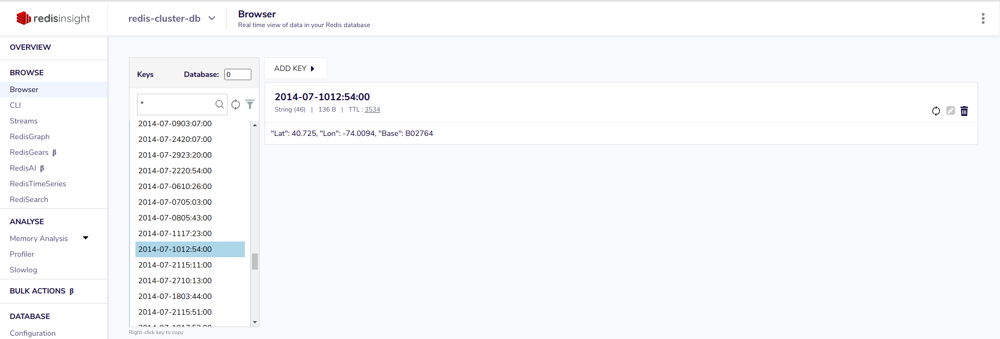

Then it tests reading from cluster. Check the log file for results.

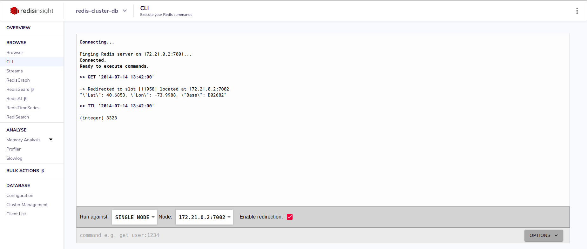

Finally, the script deletes all the data using simple `FLUSHALL` command.

But other commands are also available.

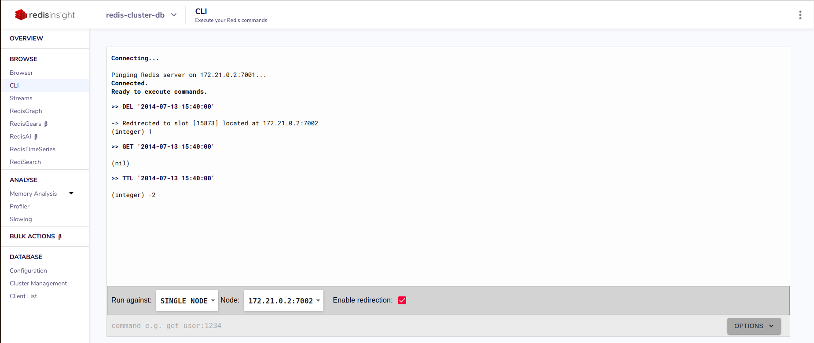
